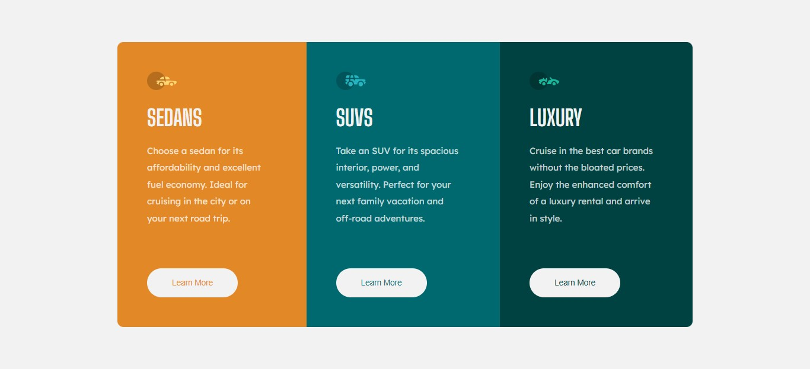

# Frontend Mentor - 3-column preview card component solution

Essa é minha solução para o [Desafio do componente do cartão de visualização de 3 colunas no Frontend Mentor](https://www.frontendmentor.io/challenges/3column-preview-card-component-pH92eAR2-). Os desafios do Frontend Mentor lhe ajudam a aprimorar habilidades de codificação construindo projetos realistas. 

## Tabela de conteúdos

- [Overview](#overview)
  - [O desafio](#o-desafio)
  - [Screenshot](#screenshot)
  - [Links](#links)
- [Feito com](#feito-com)
- [Autor](#autor)

## Overview

### O desafio

Os usuários devem ser capazes de:

- Ver o layout ideal dependendo do tamanho da tela do dispositivo
- Ver os estados de foco para elementos interativos

### Screenshot

### Links

- Solution URL: [Solution](#)
- Live Site URL: [Live Site](#)

## Feito com

- Marcação HTML5 semântica
- HTML & CSS puro
- Propriedades CSS personalizadas
- Flexbox

## Autor

- Frontend Mentor - [@Gabriel-H502](https://www.frontendmentor.io/profile/Gabriel-H502)
- FreeCodeCamp - [@Gabriel-H502](https://www.freecodecamp.org/Gabriel-H502) 
- GitHub - [Gabriel-H502](https://github.com/Gabriel-H502)